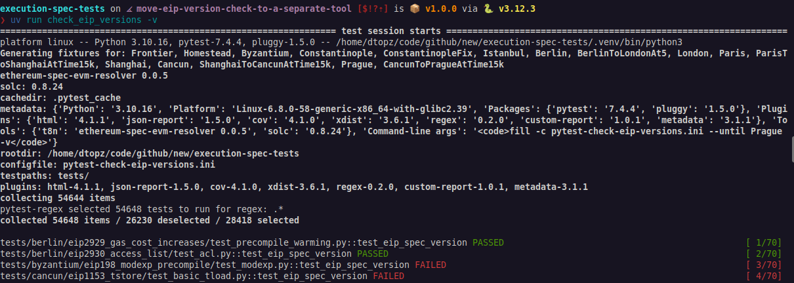
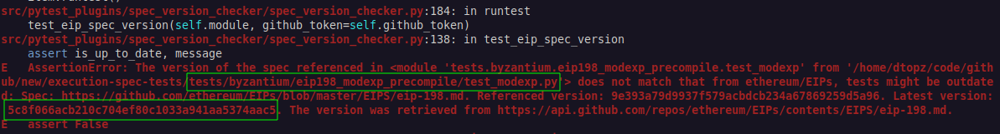

# Referencing an SIP Spec Version

Tests that implement features from an Sila Improvement Proposal ([sila/SIPs](https://github.com/sila/SIPs/tree/master/SIPS)) must define the SIP's markdown SHA digest within the test's Python module. This ensures our tests stay up-to-date with any changes to the SIP specifications.

The `check_sip_versions` command-line utility automatically verifies that all SIP references in the codebase are current. It works by comparing the SHA specified in the test against the latest version in the sila/SIPs repository. This utility uses pytest to generate test cases for every module that includes "sip" in its path.

<figure markdown>  <!-- markdownlint-disable MD033 (MD033=no-inline-html) -->
  { width=auto align=center}
</figure>

!!! note "The SHA digest value is provided in the failure message of the corresponding test"

    <figure markdown>  <!-- markdownlint-disable MD033 (MD033=no-inline-html) -->
      { width=auto align=center}
    </figure>

!!! info "Understanding and Retrieving the SIP Markdown's SHA Digest"

    The SHA value is the output from git's `hash-object` command, for example:

    ```console
    git clone git@github.com:sila/SIPs
    git hash-object SIPS/SIPS/sip-3651.md
    # output: d94c694c6f12291bb6626669c3e8587eef3adff1
    ```

    and can be retrieved from the remote repo via the Github API on the command-line as following:

    ```console
    sudo apt install jq
    curl -s -H "Accept: application/vnd.github.v3+json" \
    https://api.github.com/repos/sila/SIPs/contents/SIPS/sip-3651.md |\
    jq -r '.sha'
    # output: d94c694c6f12291bb6626669c3e8587eef3adff1
    ```

## How to Add a Spec Version Check

This check accomplished by adding the following two global variables anywhere in the Python source file:

| Variable Name             | Explanation                                                                                                                                                     |
| ------------------------- | --------------------------------------------------------------------------------------------------------------------------------------------------------------- |
| `REFERENCE_SPEC_GIT_PATH` | The relative path of the SIP markdown file in the [sila/SIPs](https://github.com/sila/SIPs/) repository, e.g. "`SIPS/sip-1234.md`"                      |
| `REFERENCE_SPEC_VERSION`  | The SHA hash of the latest version of the file retrieved from the Github API:<br/>`https://api.github.com/repos/sila/SIPs/contents/SIPS/sip-<SIP Number>.md` |

## Running the `check_sip_versions` Command Locally

A Github Personal Access Token (PAT) is required to avoid rate-limiting issues when using the Github API. The token can be specified via an environment variable or via the command-line. For example, the Github CLI can be used to obtain a token:

```bash
uv run check_sip_versions --github-token=$(gh auth token)
```

or a PAT can be created at: https://github.com/settings/personal-access-tokens/new.

By default, tests for every fork are checked, including forks under development. Pass `--fork` or `--until` to narrow the fork range, or a specific test path to limit the scope:

```shell
uv run check_sip_versions --github-token=$(gh auth token) tests/shanghai/sip3651_warm_coinbase/
```

This would only check SIP versions for the SIP-3651 tests in the `shanghai/sip3651_warm_coinbase` sub-directory.

## Example

Here is an example from [./tests/shanghai/sip3651_warm_coinbase/test_warm_coinbase.py](../tests/shanghai/sip3651_warm_coinbase/test_warm_coinbase/index.md):

```python
REFERENCE_SPEC_GIT_PATH = "SIPS/sip-3651.md"
REFERENCE_SPEC_VERSION = "d94c694c6f12291bb6626669c3e8587eef3adff1"
```

The SHA digest was retrieved [from here](https://api.github.com/repos/sila/SIPs/contents/SIPS/sip-3651.md).
